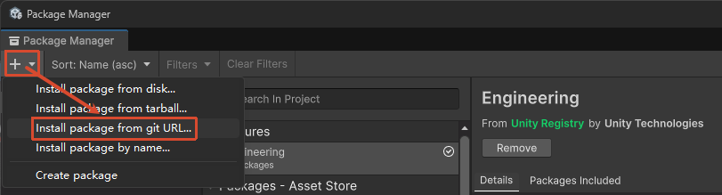
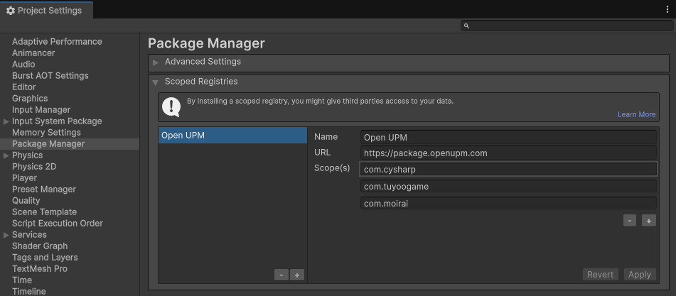
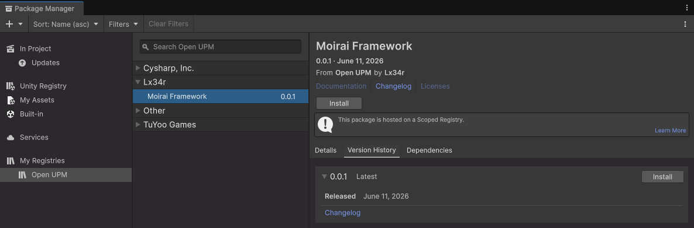

Moirai Framework
===

[](https://unity3d.com/)
[](https://openupm.com/packages/com.moirai.framework/)
[](https://github.com/TeamMoirai/com.moirai.framework/issues)
[](https://github.com/TeamMoirai/com.moirai.framework)
[](https://github.com/TeamMoirai/com.moirai.framework)
[](https://github.com/TeamMoirai/com.moirai.framework/blob/main/README_EN.md)
[](https://deepwiki.com/TeamMoirai/com.moirai.framework)

---


---

## 📖 简介

**Moirai Framework** 是一个简单（新手友好、开箱即用）且强大的 Unity 框架全平台解决方案。

### ✨ 核心特性

- 🚀 **开箱即用** - 5 分钟即可上手整套开发流程，代码整洁，思路清晰
- 🔥 **高性能** - 基于 UniTask 的异步系统，零 GC 事件分发，严格的内存管理
- 🧩 **高内聚低耦合** - 服务化设计，可轻松移除或替换不需要的服务
- 🔄 **热更新支持** - 集成 HybridCLR，全平台热更新流程已跑通
- 🔐 **代码混淆** - 集成 Obfuz，支持代码混淆加固，保护核心逻辑
- 📦 **资源管理** - 集成 YooAsset，支持 LRU、ARC 缓存策略，自动资源释放
- 📊 **配置表系统** - 集成 Luban，支持懒加载、异步加载、同步加载
- 🎨 **UI 框架** - 商业化 UI 开发流程，支持代码自动生成
- 🌍 **全平台支持** - Windows、Android、iOS、WebGL、微信小游戏等

---

<!-- START doctoc generated TOC please keep comment here to allow auto update -->
<!-- DON'T EDIT THIS SECTION, INSTEAD RE-RUN doctoc TO UPDATE -->
## 📚 目录

- [🚀 快速开始](#-%E5%BF%AB%E9%80%9F%E5%BC%80%E5%A7%8B)
  - [环境要求](#%E7%8E%AF%E5%A2%83%E8%A6%81%E6%B1%82)
  - [快速上手](#%E5%BF%AB%E9%80%9F%E4%B8%8A%E6%89%8B)
    - [下载安装](#%E4%B8%8B%E8%BD%BD%E5%AE%89%E8%A3%85)
      - [方式一：一键安装（推荐）](#%E6%96%B9%E5%BC%8F%E4%B8%80%E4%B8%80%E9%94%AE%E5%AE%89%E8%A3%85%E6%8E%A8%E8%8D%90)
      - [方式二：UPM 安装](#%E6%96%B9%E5%BC%8F%E4%BA%8Cupm-%E5%AE%89%E8%A3%85)
      - [方式三：手动安装](#%E6%96%B9%E5%BC%8F%E4%B8%89%E6%89%8B%E5%8A%A8%E5%AE%89%E8%A3%85)
    - [初始设置](#%E5%88%9D%E5%A7%8B%E8%AE%BE%E7%BD%AE)
      - [场景打包](#%E5%9C%BA%E6%99%AF%E6%89%93%E5%8C%85)
      - [配置表服务](#%E9%85%8D%E7%BD%AE%E8%A1%A8%E6%9C%8D%E5%8A%A1)
    - [快捷功能](#%E5%BF%AB%E6%8D%B7%E5%8A%9F%E8%83%BD)
- [🏗️ 架构](#-%E6%9E%B6%E6%9E%84)
  - [服务系统](#%E6%9C%8D%E5%8A%A1%E7%B3%BB%E7%BB%9F)
  - [订阅/派发异常分级约定](#%E8%AE%A2%E9%98%85%E6%B4%BE%E5%8F%91%E5%BC%82%E5%B8%B8%E5%88%86%E7%BA%A7%E7%BA%A6%E5%AE%9A)
  - [启动流程](#%E5%90%AF%E5%8A%A8%E6%B5%81%E7%A8%8B)
- [📦 功能服务](#-%E5%8A%9F%E8%83%BD%E6%9C%8D%E5%8A%A1)
- [🧰 核心工具](#-%E6%A0%B8%E5%BF%83%E5%B7%A5%E5%85%B7)
  - [Attributes — 自定义属性](#attributes--%E8%87%AA%E5%AE%9A%E4%B9%89%E5%B1%9E%E6%80%A7)
  - [Events — 事件系统](#events--%E4%BA%8B%E4%BB%B6%E7%B3%BB%E7%BB%9F)
  - [MemoryPool — 内存池](#memorypool--%E5%86%85%E5%AD%98%E6%B1%A0)
  - [Singleton — 单例系统](#singleton--%E5%8D%95%E4%BE%8B%E7%B3%BB%E7%BB%9F)
  - [GameLog — 日志系统](#gamelog--%E6%97%A5%E5%BF%97%E7%B3%BB%E7%BB%9F)
  - [GameTime — 游戏时间](#gametime--%E6%B8%B8%E6%88%8F%E6%97%B6%E9%97%B4)
  - [GameProfiler — 性能分析](#gameprofiler--%E6%80%A7%E8%83%BD%E5%88%86%E6%9E%90)
  - [GameSettings — 游戏设置](#gamesettings--%E6%B8%B8%E6%88%8F%E8%AE%BE%E7%BD%AE)
  - [GameException — 异常系统](#gameexception--%E5%BC%82%E5%B8%B8%E7%B3%BB%E7%BB%9F)
  - [ToolRegistry — 组件注册表](#toolregistry--%E7%BB%84%E4%BB%B6%E6%B3%A8%E5%86%8C%E8%A1%A8)
  - [Obfuz — 代码混淆](#obfuz--%E4%BB%A3%E7%A0%81%E6%B7%B7%E6%B7%86)
  - [DataStructure — 数据结构](#datastructure--%E6%95%B0%E6%8D%AE%E7%BB%93%E6%9E%84)
  - [Extensions/R3 — 响应式扩展](#extensionsr3--%E5%93%8D%E5%BA%94%E5%BC%8F%E6%89%A9%E5%B1%95)
  - [Utility — 工具集](#utility--%E5%B7%A5%E5%85%B7%E9%9B%86)
- [🛠️ 编辑器工具](#-%E7%BC%96%E8%BE%91%E5%99%A8%E5%B7%A5%E5%85%B7)
- [🧪 测试约定](#-%E6%B5%8B%E8%AF%95%E7%BA%A6%E5%AE%9A)
- [📁 推荐项目结构](#-%E6%8E%A8%E8%8D%90%E9%A1%B9%E7%9B%AE%E7%BB%93%E6%9E%84)
- [🤝 贡献与支持](#-%E8%B4%A1%E7%8C%AE%E4%B8%8E%E6%94%AF%E6%8C%81)
  - [🌟 生态依赖](#-%E7%94%9F%E6%80%81%E4%BE%9D%E8%B5%96)
  - [👥 贡献者](#-%E8%B4%A1%E7%8C%AE%E8%80%85)

<!-- END doctoc generated TOC please keep comment here to allow auto update -->

## 🚀 快速开始

### 环境要求

- **Unity 版本**: 2022.3.x（推荐）或更高
- **开发环境**: .NET 4.x
- **依赖插件**: [Odin Inspector and Serializer](https://assetstore.unity.com/packages/tools/utilities/odin-inspector-and-serializer-89041)
- **支持平台**: Windows、OSX、Android、iOS、WebGL、微信小游戏

### 下载安装

#### 方式一：一键安装（推荐）

1. 通过以下任一方式安装 **Framework Installer**：

   - 在 **Window/Package Manager** 中，通过 Git URL 安装：

     ```bash
     https://github.com/TeamMoirai/com.moirai.framework.git#installer
     ```

     

   - 或克隆 `installer` 分支至工程目录（Assets/...）：

     ```bash
     git clone --branch installer --single-branch https://github.com/TeamMoirai/com.moirai.framework.git Scripts/Installer
     ```

2. 回到 Unity，手动执行菜单 `Tools/Install Framework`。

3. 安装完成后可安全删除该脚本。

#### 方式二：UPM 安装

1. 在 **Project Settings/Package Manager** 中，手动添加 **Scoped Registry**：

   ```text
   // 输入以下内容（国际版）
   Name: Open UPM
   URL: https://package.openupm.com
   Scope(s): com.cysharp
             com.tuyoogame
             com.moirai
   ```

   

2. 在 **Window/Package Manager** 中，选中 **Moirai Framework**，点击 **Install** 进行安装：

   

3. <a id="manual-import"></a>手动复制 `工程根目录/Library/PackageCache/com.moirai.framework@xxx/Templates~/` 下 **@Requirements** 文件夹内的所有内容到 **工程根目录/Assets** 目录。

   （可选）根据需要选择同目录下合适的模板复制到工程，一般选择 **NormalTemplate** 即可。

#### 方式三：手动安装

1. 以下获取框架的方式任选其一：

   - 在 **Window/Package Manager** 中，通过 Git URL 安装：

     ```bash
     https://github.com/TeamMoirai/com.moirai.framework.git
     ```

   - 在发布的 Release 版本中，选择最新版本下载 **Source Code** 压缩包。

2. 参见 **[方式二第 3 步](#manual-import)**，将 `Templates~/@Requirements` 内容复制进工程。

### 初始设置

#### 场景打包

将 `Scenes/main.unity`（随模板复制进工程）加入打包列表：

- Unity 6.0+：`File -> Build Profiles -> Scene List`
- Unity 6.0-：`File -> Build Settings -> Scenes In Build`

#### 配置表服务

- 在 `Tools/Framework Settings` 窗口选择 `[框架]Luban 配置`，点击 `生成 Config 到指定目录`。
- 初次生成时，导出前先执行 **build-luban** 编译（脚本位于模板 `Config/` 目录），或自行导入 Luban 至配置表根目录。
- 如果移动了配置表目录，需在 `Tools/Framework Settings` 的 `[框架]Luban 配置` 中手动更新——`重定向 Config 目录`。

### 运行

#### 编辑器模式运行

在 `Tools/Framework Settings` 的 `[服务]资源设置` 中将 `PlayMode` 设为 `EditorSimulate`（编辑器下的模拟模式，默认值），点击 `Play` 开始运行。

#### 打包运行（热更新流程）

1. 运行菜单 `HybridCLR/Install...` 安装 HybridCLR（HybridCLR 包菜单）
2. 运行菜单 `HybridCLR/Define Symbols/Enable HybridCLR` 开启热更新
3. 运行菜单 `HybridCLR/Generate/All` 进行必要的生成操作（HybridCLR 包菜单）
4. 运行菜单 `HybridCLR/Build/BuildAssets And CopyTo AssemblyTextAssetPath` 生成热更新 DLL
5. 运行菜单 `YooAsset/Bundle Builder` 构建 AssetBundle（YooAsset 包菜单）
6. 打开 Build Settings，点击 `Build And Run`

> 💡 **提示**: 遇到问题请查看 [HybridCLR 常见错误](https://hybridclr.doc.code-philosophy.com/docs/help/commonerrors)

---

## 🏗️ 架构

```
com.moirai.framework/
├── Runtime/                    # 核心框架程序集 (Moirai.Atropos)
│   ├── Core/                   # 与具体玩法无关的基础设施
│   │   ├── Foundation/         # 基础构件：自定义属性、常量、数据结构、扩展方法、异常、模型
│   │   ├── Infrastructure/     # 基础设施：事件系统、GameApp、性能分析、内存池、混淆、对象池、单例、任务
│   │   └── Utilities/          # 工具集：日志、设置、时间、加密、HTTP、反射、缓动等 30+ 工具类
│   └── Services/               # 功能服务（每个服务一份文档，见 Documentation~）
│       ├── Kernel/             # 服务系统基座（Contracts / Interception / World）
│       ├── Audio/              # 音频系统（分类/代理/混音/淡入淡出）
│       ├── ConfigTable/        # 配置表管理
│       ├── Debugger/           # 运行时调试器
│       ├── Input/              # 输入系统（键鼠/手柄/移动端）
│       ├── Localization/       # 本地化（文本/图片/音频/Timeline）
│       ├── Pooling/            # 对象池服务（通用池/GameObject 池）
│       ├── Procedure/          # 流程管理
│       ├── Resource/           # YooAsset 资源管理
│       ├── Save/               # 存档系统（多块容器/多后端序列化/加密/迁移/云同步）
│       ├── Scene/              # 场景管理
│       ├── Timer/              # 计时器（时间轮 + 帧计时双引擎）
│       └── UI/                 # UI 框架（窗口/控件/层）
├── Editor/                     # 编辑器工具集（Foundation / Services / Tools / Utilities）
├── Plugins/                    # 第三方库
├── Samples~/                   # 示例
├── SourceGenerators/           # 预编译源生成器（HandlerHost / SaveServiceCodegen / ServiceDependency）
├── Templates~/                 # 项目初始模板（@Requirements / Config / HybridTemplate / NormalTemplate）
├── Documentation~/             # 双语服务文档（zh / en）
└── Tests/                      # 单元测试（EditorMode / PlayMode / Player / Coverage）
```

### 服务系统

框架采用**服务化架构**，所有子系统均为继承 `ServiceBase` 的普通 C# 类（非 MonoBehaviour），由统一服务世界 `ServiceWorld` 管理注册、生命周期、轮询与作用域；入口 `GameApp` 驱动世界轮询（内建更新循环、引擎回调代理与协程托管）。

```csharp
// 服务访问 — 各服务提供静态外观（HandlerHost 源生成），内部懒加载
ResourceService.LoadLease<Sprite>("Assets/AssetRaw/UI/icon.png");
UIService.ShowUI<MainWindow>();
TimerService.Delay(1f, () => Debug.Log("1s"));

// 动态服务查找
var my = GameServices.GetRequiredService<MyService>();
```

**服务生命周期：**

- `OnInit()` — 服务初始化；`Shutdown()` — 服务销毁（支持 `IAsyncShutdownService` 异步关闭）
- 依赖通过 `[ServiceDependency]` 特性声明，两阶段构建：`RegisterService` 仅入图，`InitializeAsync()` 按依赖图拓扑排序统一驱动 OnInit（缺失/循环依赖 fail-fast，初始化顺序与注册顺序无关）
- 实现 `IServiceTickable`、`IServiceFixedTickable`、`IServiceLateTickable` 接口注册进轮询循环
- 通过 `Priority` 属性控制轮询顺序（框架内置服务统一 ≤ -1000，业务服务默认 0 及以上），通过 `Scope`（App / Scene / Gameplay）控制生命周期范围，场景卸载时自动清理场景与玩法级服务
- `ServiceWorld` 可 `new` 构造隔离世界（测试/沙盒），`GameServices` 静态外观仅是默认世界的投影

> 📖 详细用法（自定义服务、作用域遮蔽、跨服务依赖）见 **[Core 服务系统文档](Documentation~/zh/Core.md)**

### 启动流程

完整的启动链由模板提供，安装后位于工程 `Assets/Scripts/GameBase/Procedure/`：

```
ProcedureLaunch → ProcedureSplash → ProcedureInitPackage → ProcedureInitResources
→ ProcedureCreateDownloader → ProcedureDownloadFile → ProcedureDownloadOver
→ ProcedureClearCache → ProcedureLoadAssembly → ProcedurePreload → ProcedurePrepare4Entrance
```

每个阶段均为独立的 `ProcedureBase` 状态，可通过 `ProcedureServiceSettings`（ScriptableObject）自定义。

> 📖 详见 **[Procedure 服务文档](Documentation~/zh/Procedure.md)**

---

## 📚 文档

每篇服务文档包含核心特性、核心类型、快速上手与进阶用法，中英双语：

- 中文文档索引：**[Documentation~/zh/Index.md](Documentation~/zh/Index.md)**
- English docs: **[Documentation~/en/Index.md](Documentation~/en/Index.md)**

### 功能服务

| 服务 | 说明 | 文档 |
|------|------|------|
| **Kernel** | 服务系统基座：`ServiceWorld` 服务世界、`GameServices` 注册/查找/作用域、`[ServiceDependency]` 依赖拓扑初始化 | [Core.md](Documentation~/zh/Core.md) |
| **Resource** | 基于 YooAsset 的资源管理：同步/异步加载、引用计数、加密、子精灵 | [Resource.md](Documentation~/zh/Resource.md) |
| **UI** | 商业化 UI 框架：栈式窗口、五层层级、Widget 子控件、绑定代码生成 | [UI.md](Documentation~/zh/UI.md) |
| **Audio** | 音频系统：分类管理、AudioAgent 代理播放、混音器、淡入淡出、句柄控制 | [Audio.md](Documentation~/zh/Audio.md) |
| **Localization** | 本地化：文本/图片/音频/Timeline 多类型注入、Google 翻译集成 | [Localization.md](Documentation~/zh/Localization.md) |
| **ConfigTable** | Luban 配置表集成：表加载与懒加载访问、转表工具链 | [ConfigTable.md](Documentation~/zh/ConfigTable.md) |
| **Procedure** | 游戏流程管理：启动链、可配置流程、自包含状态机 | [Procedure.md](Documentation~/zh/Procedure.md) |
| **Input** | 多平台输入抽象：Input System / 旧版输入 / 移动端 UI 触控、按键提示 | [Input.md](Documentation~/zh/Input.md) |
| **Save** | 可插拔存档系统：单文件多数据块容器、JSON/MessagePack/MemoryPack/Protobuf 多后端序列化、AES 加密与 GZip 压缩、文件级版本迁移总线、无代码组件保存（SourceGenerator）、云同步 | [Save.md](Documentation~/zh/Save.md) |
| **Scene** | 场景管理：基于 YooAsset SceneHandle 的异步加载/激活/卸载 | [Scene.md](Documentation~/zh/Scene.md) |
| **Timer** | 双引擎计时器：四级时间轮（按秒）+ 帧计时（按帧）、版本化句柄、预热、统计 | [Timer.md](Documentation~/zh/Timer.md) |
| **ObjectPool** | 服务级对象池：单次/多次 Spawn 池、GameObject 池 | [ObjectPool.md](Documentation~/zh/ObjectPool.md) |
| **Debugger** | 运行时调试器：可注册调试窗口、日志回放 | [Debugger.md](Documentation~/zh/Debugger.md) |

### 核心工具

| 工具 | 说明 | 文档 |
|------|------|------|
| **Attributes** | ~20 个自定义属性绘制器 + Odin 扩展（条件显示、Inspector 按钮、Layer/Tag/资源路径选择、ProviderDropdown 等） | — |
| **Events** | 移植自 UIElements 的池化冒泡事件系统：零 GC、TrickleDown → BubbleUp、`StopPropagation()` / `PreventDefault()`、可视化调试窗口 | — |
| **Singleton** | 单例家族：纯 C#（volatile 双检锁）/ MonoBehaviour（主线程物化）/ 注册式，线程规则 fail-fast | [Singleton.md](Documentation~/zh/Singleton.md) |
| **MemoryPool** | 零 GC 页式内存池：非托管元数据、EWMA 自适应水位线、阶段预算 | [MemoryPool.md](Documentation~/zh/MemoryPool.md) |
| **GameApp** | Unity 生命周期代理：协程托管、帧更新注入、引擎事件注入、游戏速度/暂停控制 | [GameApp.md](Documentation~/zh/GameApp.md) |
| **PlayerLoopDriver** | 剥离 Mono 的 PlayerLoop 逻辑驱动：零分配 Handler、注入/恢复、编辑器可视化 | [PlayerLoopDriver.md](Documentation~/zh/PlayerLoopDriver.md) |
| **GameLog** | 日志系统：运行时级别过滤、可插拔后端（Default / Serilog / ZLogger / Unity Logging）、T4 生成的格式化重载、拦截 Unity 原生 `Debug.Log` | — |
| **GameTime** | 轻量时间访问器，每帧采样一次，避免频繁调用 `Time.deltaTime` | — |
| **GameProfiler** | 条件编译的性能采样（`PROFILER_ENABLE` 宏），宏关闭时零开销 | — |
| **GameSettings** | 框架设置 / 画面设置 / 更新设置（菜单 `Tools/Framework Settings`） | — |
| **GameException** | 自定义游戏异常：错误码 + 上下文信息 | — |
| **ToolRegistry** | 高性能组件注册/查找：O(1) 查找、场景感知清理、零 GC 批量查询、线程安全 | — |
| **Obfuz** | [Obfuz](https://github.com/focus-creative-games/obfuz) 代码混淆集成：程序集加载后自动初始化加密虚拟机 | — |
| **DataStructure** | `IOCContainer` / `PriorityQueue<T>` / `SparseArray<T>` / `SerializableDictionary<K,V>` / `ShuffleBag<T>` 等 12 个 | — |
| **Extensions/R3** | R3 响应式扩展 + UGUI 绑定：`OnClickAsObservable()`、`ReactiveProperty` 双向绑定 | — |
| **StringUtility** | 字符串格式化与构建：可插拔 Handler、池化 StringBuilder、三种使用模式 | [StringUtility.md](Documentation~/zh/StringUtility.md) |
| **JsonUtility** | JSON 序列化/反序列化：可插拔 Handler、字节快速通路、允许列表成员筛选 | [JsonUtility.md](Documentation~/zh/JsonUtility.md) |
| **ObjectUtility** | 对象实例化/销毁：可插拔 Handler（单机 / Photon Fusion 联网感知） | [ObjectUtility.md](Documentation~/zh/ObjectUtility.md) |
| **TweenUtility** | 缓动系统：自研 / PrimeTween / LitMotion 可插拔引擎、贝塞尔路径、统一缓动参数 | [TweenUtility.md](Documentation~/zh/TweenUtility.md) |

<details>
<summary>Utility — 全部工具类一览</summary>

| 工具 | 说明 |
|------|------|
| `AlgorithmUtility` | 算法工具 |
| `AssemblyUtility` | 程序集工具 |
| `ColorsUtility` | 颜色工具 |
| `CommandLineUtility` | 命令行解析 |
| `ConverterUtility` | 类型转换 |
| `CoroutineUtility` | 协程工具 |
| `DebugDrawUtility` | 调试绘制 |
| `DiagnosticsUtility` | 诊断工具 |
| `EncryptionUtility` | 加密工具 |
| `FileUtility` | 文件操作 |
| `HttpUtility` | HTTP 请求（支持 UniTask） |
| `JsonUtility` | JSON 序列化/反序列化，[文档](Documentation~/zh/JsonUtility.md) |
| `MainThreadDispatcher` | 主线程调度 |
| `MarshalUtility` | 非托管内存操作 |
| `MaterialUtility` | 材质工具 |
| `MathsUtility` | 数学工具（含 Unity.Mathematics 集成） |
| `ObjectUtility` | 对象实例化/销毁，[文档](Documentation~/zh/ObjectUtility.md) |
| `PathUtility` | 路径工具 |
| `ReflectionUtility` | 反射工具 |
| `StringUtility` | 字符串格式化与构建，[文档](Documentation~/zh/StringUtility.md) |
| `ToolRegistry` | 组件注册表 |
| `TweenUtility` | 缓动系统（含贝塞尔路径），[文档](Documentation~/zh/TweenUtility.md) |
| `UniParallel` | UniTask 并行任务收集器（等待全部完成） |
| `UnityUtility` | Unity 通用工具 |

</details>

---

## 🛠️ 编辑器工具

| 工具 | 用途 |
|------|------|
| Atlas Maker | 图集创建、引用分析、变动自动重生成、配置面板（`Tools/图集工具`） |
| Custom Attributes | ~20 个自定义属性绘制器 + Odin 扩展 |
| Define Symbols | Debug / Log / Profiler / HybridCLR / Obfuz 宏定义管理 |
| Editor Design | 编辑器图标资源、GUIStyle 查看器 |
| Event Debugger | 可视化事件派发调试窗口（`Window/Event Debugger`） |
| Framework Settings | 框架设置窗口：音频组、Luban、流程、更新设置（`Tools/Framework Settings`） |
| HybridCLR | 热更新宏定义与热更 DLL 构建命令（`HybridCLR/Define Symbols`、`HybridCLR/Build`） |
| Inspector | Asset / Core 组件自定义 Inspector |
| Luban Tools | Luban 配置表生成、表格目录直达（`Tools/Config`） |
| Maintenance | 清理空文件夹、查找丢失脚本、预制体查找器、分组选择、锁定 Inspector |
| PlayerLoop Debugger | PlayerLoop 注入状态可视化（`Window/PlayerLoop Debugger`） |
| Reference Finder | 资源依赖/引用树视图（`Tools/资产相关/查找资产引用`） |
| Release Tools | 构建流水线窗口、一键打包 Android / iOS / Windows / AssetBundle（`Tools/Build`） |
| Save Service | 存档浏览器（`Tools/Moirai/Save/Save Browser`）、Schema 快照导出、无代码保存组件编辑器 |
| Tasks Editor | 任务运行器编辑器 |
| Tween | 缓动属性绘制器 |
| UI Service | UI 绑定代码自动生成（`GameObject/ScriptGenerator`）、组件 Inspector |
| Input Service | 输入动作配置编辑器、按键图标集合编辑器 |
| Utility | 命令行读取、Shell 调用等 |
| YooAsset | 构建缓存清理、内置目录/补丁包工具、自定义构建管线、Shader 变体收集 |

---

## 🤝 贡献与支持

欢迎 Issue 与 PR。贡献前请阅读 **[贡献指南](CONTRIBUTING.md)**——包含开发流程、测试要求，以及订阅/派发异常分级等全仓一致的代码约定。

### 🌟 生态依赖

| 项目 | 描述 |
|------|------|
| **[UniTask](https://github.com/Cysharp/UniTask)** | 为 Unity 提供高效、无分配的异步/等待集成。 |
| **[YooAsset](https://github.com/tuyoogame/YooAsset)** | 商业级经历百万 DAU 游戏验证的资源管理系统 |
| **[HybridCLR](https://github.com/focus-creative-games/hybridclr)** | 特性完整、零成本、高性能、低内存的近乎完美的 Unity 全平台原生 C# 热更方案。 |
| **[Luban](https://github.com/focus-creative-games/luban)** | 最佳游戏配置解决方案 |
| **[Obfuz](https://github.com/focus-creative-games/obfuz)** | 深度集成 Unity 工作流的代码混淆加固方案，兼容热更新。 |

### 👥 贡献者

[](https://github.com/TeamMoirai/com.moirai.framework/graphs/contributors)

## 📄 许可证

[MIT License](LICENSE.txt)
